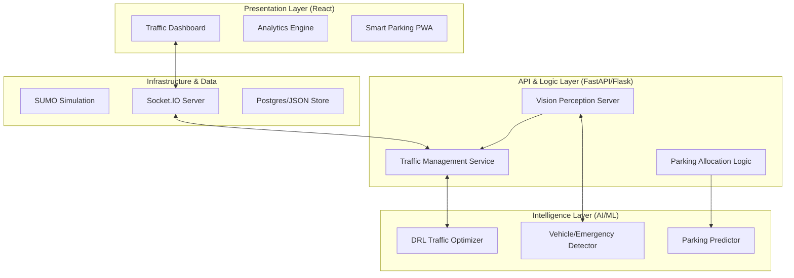

# 🏛️ UrbanFlow: System Architecture

## Document Control
| Field | Details |
|-------|---------|
| Project Name | UrbanFlow |
| Document Version | 1.1 (Post-Hackathon) |
| Last Updated | 19/03/2026 |
| Author(s) | Antigravity AI, Shubham Suryawanshi |
| Status | Finalized |

---

## 1. Introduction
### 1.1 Purpose
This document provides a comprehensive overview of the UrbanFlow architecture, detailing how the Python-based AI engines, React frontend, and external sensors interact to optimize traffic flow.

### 1.2 Scope
Covers the Backend AI services, the Simulation Environment, the Frontend Dashboard, and the Mobile Perception Layer.

---

## 2. Architectural Goals
1.  **AI-Driven Optimization**: Achieve 25-40% reduction in vehicle wait times compared to fixed timers.
2.  **Low Latency Perception**: Process camera frames and update signal decisions in under 500ms.
3.  **Scalability**: Support multiple intersections within a unified city-wide management dashboard.
4.  **Hardware Independence**: Allow standard smartphone cameras to act as high-quality traffic sensors.

---

## 3. System Overview

UrbanFlow is composed of four primary subsystems:

1.  **Perception Layer (The Eyes)**: 
    *   **Mobile Camera Service**: Flask-based server capturing frames from browser-based camera links.
    *   **Vision Engine**: OpenCV MOG2 and YOLOv11 used for vehicle detection, speed estimation, and illegal parking identification.
2.  **Decision Layer (The Brain)**: 
    *   **RL Engine**: PyTorch implementation of Actor-Critic (A2C) reinforcement learning.
    *   **Simulation Adapter**: Hybrid environment that bridges the AI to both SUMO (real simulator) and Mock environments.
3.  **Communication Layer (The Nervous System)**:
    *   **WebSockets**: Real-time bidirectional data flow between backend, mobile, and dashboard.
    *   **FastAPI REST**: Standard interfaces for status, configuration, and analytics retrieval.
4.  **Presentation Layer (The Face)**:
    *   **React Dashboard**: High-performance UI visualizing traffic maps, AI decisions, and real-time camera feeds.

---

## 4. Logical View

### 4.1 Component Diagram (Mermaid)

---

## 5. Component Design

### 5.1 Backend: Traffic AI Engine
*   **Technologies**: Python 3.11, PyTorch, FastAPI.
*   **Role**: Receives traffic states (counts, queues), passes them through the neural network, and outputs optimal signal phases.
*   **Reward Function**: `r = -(Total Waiting Time + Queue Penalty + Emergency Delay)`.

### 5.2 Mobile Perceptor
*   **Technologies**: Flask, OpenCV, MediaDevices API.
*   **Role**: A lightweight server that allows any smartphone to become a "Smart Camera". It streams frames to the server where detection occurs.

### 5.3 Smart Parking Logic
*   **Technologies**: Scikit-learn, FastAPI.
*   **Role**: Manages parking spot state, processes bookings, and detects illegal parking via vision logic.

---

## 6. Data Architecture

### 6.1 Real-time State Vector
The system maintains a 32-dimensional state vector for the AI:
`[Lane_1_Queue, Lane_1_Count, Lane_1_Speed, Current_Phase, ... repeated for 4 lanes/intersections ...]`

### 6.2 Data Flow
1.  **Input**: Camera (Mobile) → Base64 Stream → OpenCV Processor.
2.  **Process**: Detected Objects → State Update → DRL Agent Decision.
3.  **Output**: AI Decision → WebSocket Broadcast → Dashboard + Simulation Controller.

---

## 7. Deployment

*   **Local/Edge**: The backend is designed to run on edge devices (like a PC at the intersection) for low latency.
*   **Containerization**: Ready for `docker-compose` to orchestrate Backend, Frontend, and Nginx.

---

## 8. Security
*   **JWT Authentication**: Secure login for Admin and City Managers.
*   **CORS Protection**: Restricted communication between origins.
*   **Rate Limiting**: Applied to socket events to prevent DDoSing the simulation engine.
