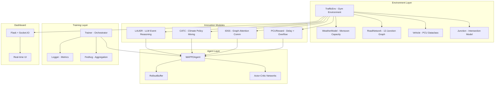
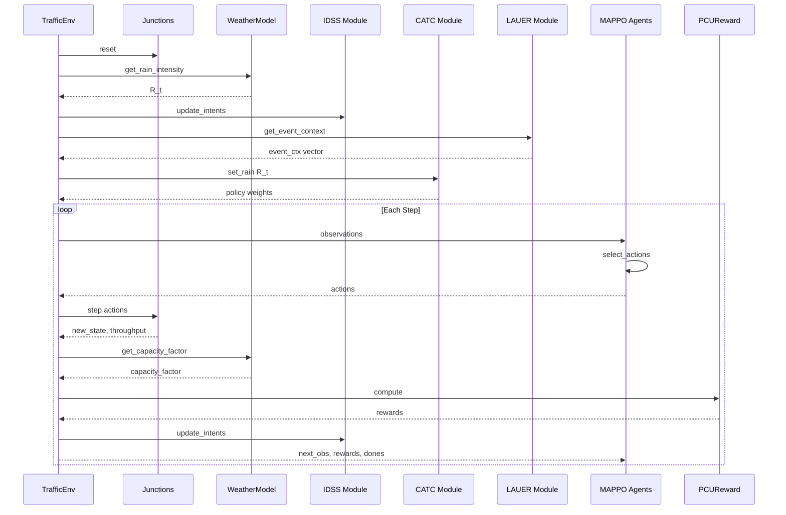

# PCU-MARL++ Implementation Plan

## Overview

This document outlines the implementation plan for building a complete traffic signal control system using Multi-Agent Reinforcement Learning with PCU (Passenger Car Unit) awareness. The system includes:

- Self-contained traffic micro-simulation (no external dependencies like CityFlow)
- Four innovation modules: PCU Reward, IDSS, CATC, LAUER
- MAPPO training pipeline with federated aggregation
- Real-time Flask dashboard for monitoring

## Architecture Diagram



## Data Flow Diagram



## Implementation Order

### Phase 1: Core Environment (Foundation)

1. **vehicle.py** - Define vehicle types, PCU values, and composition
2. **weather.py** - Monsoon capacity model with rain intensity
3. **junction.py** - Single intersection with phase control and vehicle discharge
4. **road_network.py** - 12-junction grid topology using NetworkX
5. **traffic_env.py** - Main Gym environment integrating all components

### Phase 2: Innovation Modules

6. **pcu_reward.py** - PCU-aware reward with Lyapunov stability
7. **idss.py** - Graph attention for inter-junction communication
8. **catc.py** - Climate-adaptive policy mixing
9. **lauer.py** - LLM-based event reasoning with fallbacks

### Phase 3: Agent Components

10. **config.py** - Centralized hyperparameters
11. **graph_utils.py** - Adjacency and distance utilities
12. **actor_critic.py** - Neural network architectures
13. **rollout_buffer.py** - Trajectory storage with GAE
14. **mappo_agent.py** - Complete MAPPO agent

### Phase 4: Training Pipeline

15. **logger.py** - TensorBoard and CSV logging
16. **federated.py** - FedAvg parameter aggregation
17. **trainer.py** - Main training orchestrator

### Phase 5: Dashboard

18. **app.py** - Flask + Socket.IO server
19. **index.html** - Dashboard UI template
20. **style.css** - Dashboard styling
21. **app.js** - Frontend interactivity

### Phase 6: Testing and Entry Points

22. **test_*.py** - Unit tests for all modules
23. **train.py** - Training entry point
24. **simulate.py** - Evaluation entry point
25. **requirements.txt** - Dependencies
26. **README.md** - Documentation

## Key Design Decisions

### 1. PCU-Weighted Queue Model

Instead of simple vehicle counts, we use PCU weights:
- Motorcycle: 0.5 PCU
- Car/Auto: 1.0 PCU
- Bus: 3.0 PCU
- Truck: 3.5 PCU

This better reflects actual road capacity usage in Indian traffic conditions.

### 2. Weather Impact Model

Linear degradation model based on research:
- Capacity factor: `1.0 - 0.4 * rain_intensity`
- Speed factor: `1.0 - 0.5 * rain_intensity`

### 3. Graph Attention Communication

Junctions within 800m communicate via learned attention:
- Intent vectors: 64 dimensions
- 4 attention heads
- Edge weights from physical travel times

### 4. Climate Policy Mixing

Three policies trained under different weather:
- Clear: R=0, capacity=1.0
- Moderate: R≈0.45, capacity=0.8
- Heavy: R>0.7, capacity=0.6

Smooth sigmoid-based mixing ensures continuity.

### 5. LLM Event Processing

Fallback hierarchy:
1. Mistral-7B (GPU)
2. GPT-2 (CPU)
3. Rule-based parser (zero dependencies)

## Hyperparameter Configuration

| Category | Parameter | Value |
|----------|-----------|-------|
| Reward | α (delay) | 1.0 |
| Reward | β (overflow) | 2.0 |
| Reward | γ (oscillation) | 0.5 |
| Reward | δ (throughput) | 0.8 |
| Reward | ε (coordination) | 0.3 |
| IDSS | intent_dim | 64 |
| IDSS | gat_heads | 4 |
| IDSS | comm_radius | 800m |
| MAPPO | clip_eps | 0.2 |
| MAPPO | gamma | 0.99 |
| MAPPO | gae_lambda | 0.95 |
| MAPPO | lr_actor | 3e-4 |
| MAPPO | lr_critic | 1e-3 |
| MAPPO | lyapunov_lambda | 0.1 |
| Training | rollout_steps | 400 |
| Training | min_green | 10s |
| Training | max_green | 120s |
| LAUER | poll_interval | 1800s |

## File Structure

```
pcu_marl/
├── __init__.py
├── env/
│   ├── __init__.py
│   ├── traffic_env.py
│   ├── junction.py
│   ├── vehicle.py
│   ├── road_network.py
│   └── weather.py
├── modules/
│   ├── __init__.py
│   ├── pcu_reward.py
│   ├── idss.py
│   ├── catc.py
│   └── lauer.py
├── agents/
│   ├── __init__.py
│   ├── actor_critic.py
│   ├── mappo_agent.py
│   └── rollout_buffer.py
├── training/
│   ├── __init__.py
│   ├── trainer.py
│   ├── federated.py
│   └── logger.py
└── utils/
    ├── __init__.py
    ├── graph_utils.py
    └── config.py

dashboard/
├── app.py
├── templates/
│   └── index.html
└── static/
    ├── style.css
    └── app.js

tests/
├── test_env.py
├── test_pcu_reward.py
├── test_idss.py
├── test_catc.py
└── test_lauer.py

train.py
simulate.py
requirements.txt
README.md
```

## Verification Checklist

- [ ] All tests pass: `pytest tests/ -v`
- [ ] Training smoke test: `python train.py --episodes 5`
- [ ] Dashboard runs: `python simulate.py --dashboard`
- [ ] Checkpoint saving/loading works
- [ ] TensorBoard logs generated
- [ ] All 12 junctions visible in dashboard
- [ ] Weather model affects capacity
- [ ] IDSS communication functional
- [ ] CATC policy switching smooth
- [ ] LAUER event parsing works

## Next Steps

1. Switch to Code mode to begin implementation
2. Start with Phase 1: Core Environment
3. Implement each module following the detailed specifications
4. Write tests alongside implementation
5. Integrate and verify each phase before proceeding
