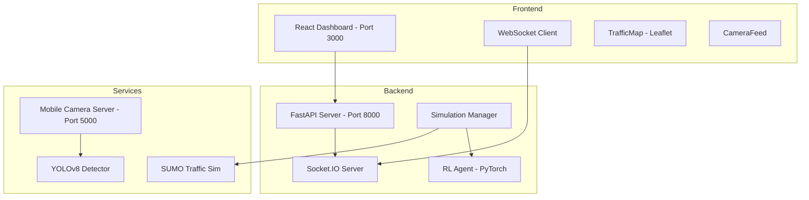

# UrbanFlow Project - Error Analysis and Fix Plan

## Project Overview

**UrbanFlow** is an AI-Powered Traffic Management System with the following architecture:



---

## Issues Identified

### 1. Missing Python Dependencies

**Issue:** The [`mobile_camera_server.py`](backend/app/services/mobile_camera/mobile_camera_server.py:14) uses `eventlet` but it is NOT listed in [`requirements.txt`](backend/requirements.txt).

**Impact:** Mobile camera server will fail to start with:
```
ModuleNotFoundError: No module named 'eventlet'
```

**Solution:** Add `eventlet` to requirements.txt

---

### 2. Missing SUMO Routes File

**Issue:** The [`sumo_files/routes/`](sumo_files/routes) directory is empty. The simulation expects `traffic_routes.rou.xml`.

**Impact:** 
- SUMO simulation will fail if started in non-mock mode
- The [`generate_sumo_network.py`](backend/generate_sumo_network.py) script requires SUMO installation

**Solution:** 
- The code already has mock mode fallback in [`environment.py`](backend/app/services/sumo/environment.py:31)
- For full simulation, either install SUMO or create routes manually

---

### 3. OpenCV/YOLO Import Errors

**Issue:** Camera features require heavy dependencies:
- `opencv-python`
- `ultralytics` (YOLOv8)
- `numpy`

**Impact:** 
- [`vehicle_detector.py`](backend/app/services/vision/vehicle_detector.py:6) imports `cv2` at top level
- [`hybrid_environment.py`](backend/app/services/vision/hybrid_environment.py:6) imports `numpy` at top level
- These will crash if dependencies not installed

**Current Mitigation:** 
- Code has try/except blocks and mock fallbacks
- [`mobile_camera_server.py`](backend/app/services/mobile_camera/mobile_camera_server.py:22) has `CV_AVAILABLE` flag

---

### 4. Virtual Environment Configuration

**Issue:** The venv was created with MSYS2 Python:
```
home = C:\msys64\ucrt64\bin
executable = C:\msys64\ucrt64\bin\python.exe
```

**Impact:** 
- May have compatibility issues with Windows-native packages
- Some packages like `torch` may need specific Windows builds

---

### 5. WebSocket Connection Issues

**Issue:** Frontend WebSocket connects to `http://localhost:8000` but may have CORS/transport issues.

**Current Configuration:**
- Backend uses `python-socketio` with `async_mode='asgi'`
- CORS is set to allow all origins
- Frontend uses `socket.io-client`

---

## Fix Plan

### Phase 1: Fix Dependencies

| Step | Action | File |
|------|--------|------|
| 1.1 | Add `eventlet` to requirements | [`backend/requirements.txt`](backend/requirements.txt) |
| 1.2 | Add `gevent` and `gevent-websocket` as alternatives | [`backend/requirements.txt`](backend/requirements.txt) |
| 1.3 | Ensure all imports have fallbacks | Vision modules |

### Phase 2: Fix SUMO Routes

| Step | Action | Details |
|------|--------|---------|
| 2.1 | Create mock routes file | Generate placeholder XML |
| 2.2 | Improve mock mode | Ensure mock mode works without SUMO |

### Phase 3: Fix Camera Server

| Step | Action | Details |
|------|--------|---------|
| 3.1 | Add eventlet import guard | Handle missing eventlet gracefully |
| 3.2 | Test mock detector mode | Ensure server starts without CV |

### Phase 4: Test All Components

| Step | Component | Command |
|------|-----------|---------|
| 4.1 | Backend API | `cd backend && uvicorn app.main:app --reload --port 8000` |
| 4.2 | Frontend | `cd frontend && npm start` |
| 4.3 | Camera Server | `cd backend && python app/services/mobile_camera/mobile_camera_server.py` |

---

## Startup Commands

After fixes are applied, run in separate terminals:

```bash
# Terminal 1: Backend API
cd backend
.venv\Scripts\activate  # Windows
pip install -r requirements.txt
uvicorn app.main:app --reload --port 8000

# Terminal 2: Frontend
cd frontend
npm install
npm start

# Terminal 3: Mobile Camera Server (optional)
cd backend
.venv\Scripts\activate
python app/services/mobile_camera/mobile_camera_server.py
```

---

## Expected Behavior After Fixes

1. **Backend** starts on port 8000, shows:
   - `WARNING: SUMO_HOME not set. Simulation features will not work.`
   - `WARNING: Torch not available. RL Agent will be in dummy mode.` (if no PyTorch)
   - `INFO: Uvicorn running on http://0.0.0.0:8000`

2. **Frontend** starts on port 3000:
   - Dashboard loads with map
   - WebSocket connects successfully
   - Mock traffic data flows

3. **Camera Server** starts on port 5000:
   - Dashboard accessible at `http://localhost:5000`
   - Works in mock mode without OpenCV

---

## Files to Modify

1. [`backend/requirements.txt`](backend/requirements.txt) - Add missing dependencies
2. Create `sumo_files/routes/traffic_routes.rou.xml` - Mock routes file
3. Optional: Improve error handling in vision modules

---

## Next Steps

Switch to **Code mode** to implement these fixes:
1. Update requirements.txt
2. Create mock SUMO routes
3. Test each component
