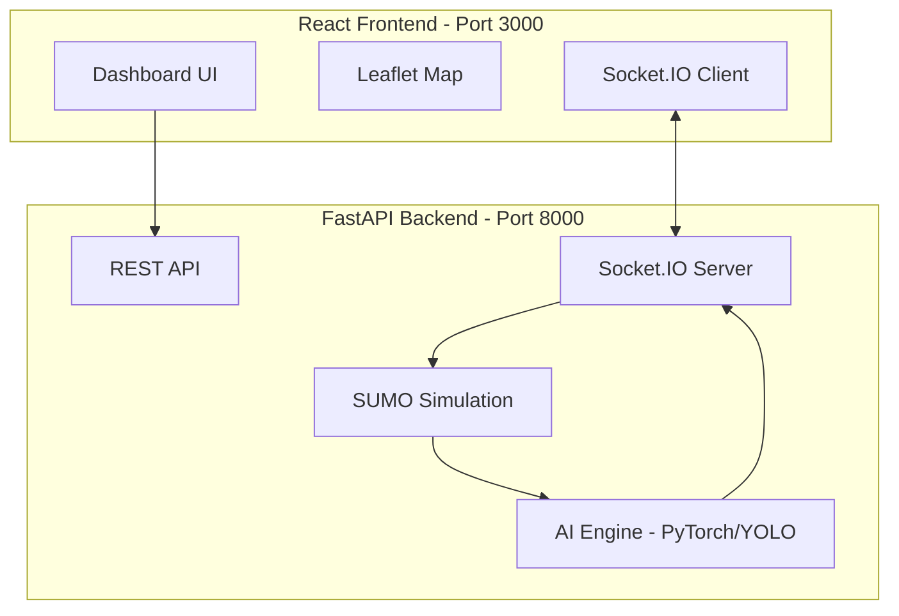

# UrbanFlow Startup Plan

## Overview
This plan outlines the steps to properly start the UrbanFlow Traffic Management System on Windows.

## Current Issues Identified

### 1. Virtual Environment Confusion
- **Problem**: Two virtual environments exist:
  - `.venv` - Created with msys64 Python (Unix-style with `bin/` folder)
  - `.venv_win` - Created with Windows Python 3.14 (Windows-style with `Scripts/` folder)
- **Impact**: Terminal 1 is running `.venv\bin\uvicorn` which is a Unix path and won't work on Windows

### 2. Active Terminals
- Terminal 1: `cd backend && .venv\bin\uvicorn app.main:app --host 0.0.0.0 --port 8000` (incorrect path)
- Terminal 2: `cd frontend && npm start` (should be working)

## Execution Plan

### Phase 1: Backend Setup

#### Step 1: Create Fresh Virtual Environment
```powershell
cd backend
python -m venv .venv
```
This will create a fresh `.venv` folder with Windows-style `Scripts/` directory.

#### Step 2: Activate Virtual Environment
```powershell
.venv\Scripts\activate
```

#### Step 3: Install Dependencies
```powershell
pip install -r requirements-windows.txt
```

**Key Dependencies** (from [`requirements-windows.txt`](backend/requirements-windows.txt)):
- FastAPI + Uvicorn (web framework)
- PyTorch CPU-only (AI/ML)
- Ultralytics/YOLO (vehicle detection)
- OpenCV (computer vision)
- Firebase Admin (authentication)
- Socket.IO (real-time communication)

### Phase 2: Start Backend Server

#### Step 4: Start Backend
```powershell
cd backend
.venv\Scripts\python.exe -m uvicorn app.main:app --reload --host 0.0.0.0 --port 8000
```

**Expected Output**:
- API available at: http://localhost:8000
- Health check: http://localhost:8000/health
- WebSocket: Socket.IO enabled

### Phase 3: Frontend Setup

#### Step 5: Install Frontend Dependencies
```powershell
cd frontend
npm install
```

#### Step 6: Start Frontend Dev Server
```powershell
cd frontend
npm start
```

**Expected Output**:
- Frontend available at: http://localhost:3000
- Proxies API calls to backend at http://localhost:8000

### Phase 4: Verification

#### Step 7: Verify Backend API
- Open http://localhost:8000 in browser
- Expected response: `{"message": "UrbanFlow API is running", "status": "online"}`

#### Step 8: Verify Frontend
- Open http://localhost:3000 in browser
- Expected: UrbanFlow dashboard loads

#### Step 9: Test Simulation
1. Click "Enter Dashboard" on homepage
2. Click "START SIMULATION" button
3. Verify traffic simulation starts on the map

## Architecture Diagram



## File References

| File | Purpose |
|------|---------|
| [`README_START.md`](README_START.md) | Startup instructions |
| [`backend/requirements-windows.txt`](backend/requirements-windows.txt) | Python dependencies |
| [`backend/app/main.py`](backend/app/main.py) | FastAPI application entry point |
| [`frontend/package.json`](frontend/package.json) | Node.js dependencies |

## Notes

- The [`README_START.md`](README_START.md) already has correct Windows-style paths
- No modifications needed to the README file
- Simply need to execute the commands in the correct order
